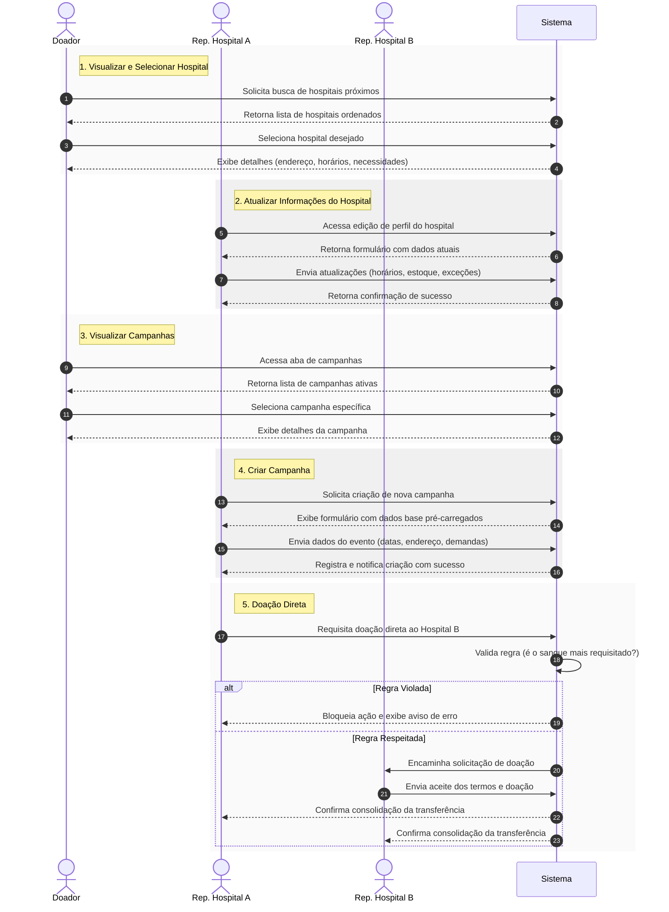

Diagrama de Sequência:

```mermaid
sequenceDiagram
    autonumber
    actor D as Doador
    actor RA as Rep. Hospital A
    actor RB as Rep. Hospital B
    participant S as Sistema

    %% Fluxo 1: Visualizar e Selecionar Hospital
    rect rgb(250, 250, 250)
    note right of D: 1. Visualizar e Selecionar Hospital
    D->>S: Solicita busca de hospitais próximos
    S-->>D: Retorna lista de hospitais ordenados
    D->>S: Seleciona hospital desejado
    S-->>D: Exibe detalhes (endereço, horários, necessidades)
    end

    %% Fluxo 2: Atualizar Informações do Hospital
    rect rgb(240, 240, 240)
    note right of RA: 2. Atualizar Informações do Hospital
    RA->>S: Acessa edição de perfil do hospital
    S-->>RA: Retorna formulário com dados atuais
    RA->>S: Envia atualizações (horários, estoque, exceções)
    S-->>RA: Retorna confirmação de sucesso
    end

    %% Fluxo 3: Visualizar Campanhas
    rect rgb(250, 250, 250)
    note right of D: 3. Visualizar Campanhas
    D->>S: Acessa aba de campanhas
    S-->>D: Retorna lista de campanhas ativas
    D->>S: Seleciona campanha específica
    S-->>D: Exibe detalhes da campanha
    end

    %% Fluxo 4: Criar Campanha
    rect rgb(240, 240, 240)
    note right of RA: 4. Criar Campanha
    RA->>S: Solicita criação de nova campanha
    S-->>RA: Exibe formulário com dados base pré-carregados
    RA->>S: Envia dados do evento (datas, endereço, demandas)
    S-->>RA: Registra e notifica criação com sucesso
    end

    %% Fluxo 5: Doação Direta entre Bancos de Sangue
    rect rgb(250, 250, 250)
    note right of RA: 5. Doação Direta
    RA->>S: Requisita doação direta ao Hospital B
    S->>S: Valida regra (é o sangue mais requisitado?)
    
    alt Regra Violada
        S-->>RA: Bloqueia ação e exibe aviso de erro
    else Regra Respeitada
        S->>RB: Encaminha solicitação de doação
        RB->>S: Envia aceite dos termos e doação
        S-->>RA: Confirma consolidação da transferência
        S-->>RB: Confirma consolidação da transferência
    end
    end
```
