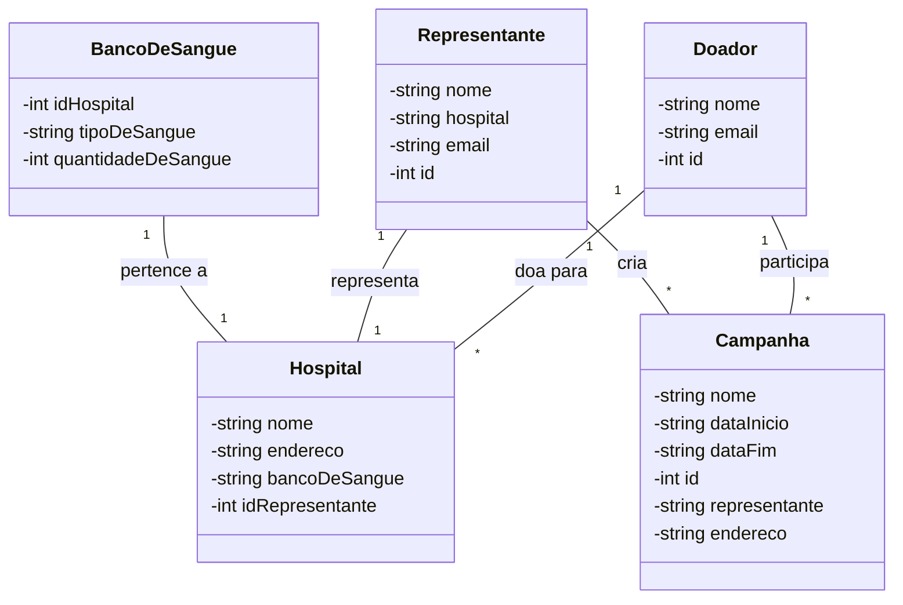

# Projeto-Doação-de-Sangue-

# links auxiliares

Link Google Docs: https://docs.google.com/document/d/1fZguRS95zDG2ZQ4rsJeOO61aht4fMMbfmpGLaomVKtQ/edit?usp=sharing

Link Google Sheets: https://docs.google.com/spreadsheets/d/1bja-UOTeAVHtsSLmCIZyrKeJUPVNS2Ls6BIC09AyRK8/edit?usp=sharing

Link Figma: https://www.figma.com/make/pD13GNYTOk4aVPxW0MsAe0/Doa%C3%A7%C3%A3o-de-Sangue-App?t=81aICpOhMsjMJMW5-20&fullscreen=1

## Diagrama de Classes

